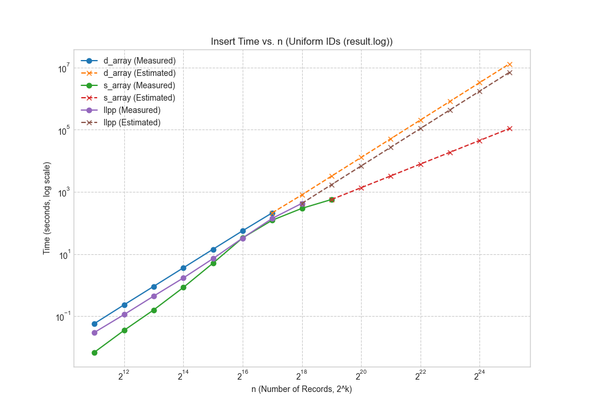
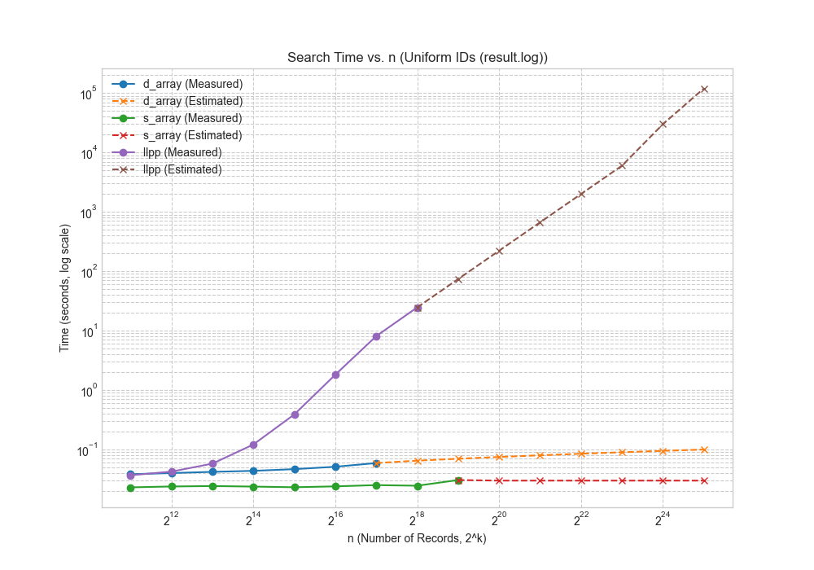
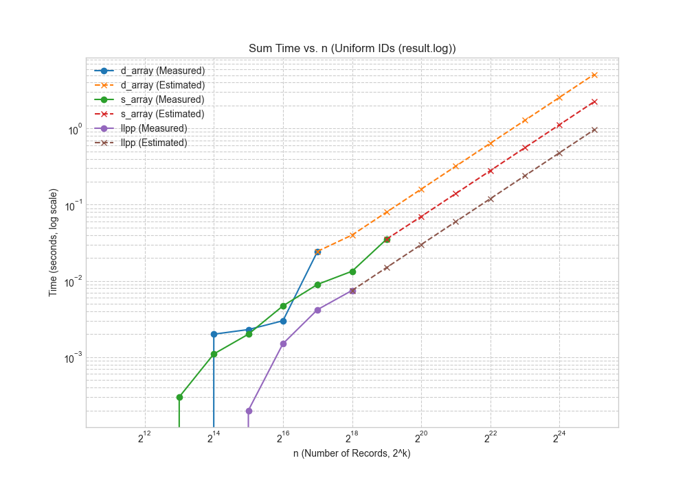

# 資料結構作業報告

**作者：** 童玉丞

**學號：** 113703052

---

## 1. 效能分析圖表

本章節呈現 `Insert`, `Search`, `Sum` 三種操作在不同資料規模 `n` 下的效能表現折線圖。所有圖表的 X 軸為資料規模 `n` (2^k)，Y 軸為執行時間（秒），且兩軸均採用對數尺度 (Log Scale) 以便觀察不同複雜度的增長趨勢。

### 1.1 Insert 操作效能圖


*圖一：執行 n 次 Insert 操作所需時間* 

### 1.2 Search 操作效能圖


*圖二：執行十萬次 Search 操作所需時間*

### 1.3 Sum 操作效能圖


*圖三：計算所有 Score 總和所需時間*

---

## 2. Insert 與 Search 核心程式碼

### 2.1 Solution 1: `d_array` (動態陣列)

#### Insert 程式碼

```cpp
void dynamic_array::insert(long long id, int score) {
    long long low = 0, high = count - 1;

    // 1. 二分搜尋檢查 ID 是否已存在
    while ( low <= high ) {
        long long mid = low + (high - low) / 2;
        if ( (*a)[mid].id == id ) {
            (*a)[mid].scores.push_back(score);
            return;
        }
        if ( (*a)[mid].id < id ) {
            low = mid + 1;
        }
        else {
            high = mid - 1;
        }
    }
    long long target_idx = low;

    // 2. 若容量不足，擴展陣列
    if ( count == capacity ) {
        exension();
    }

    // 3. 移動元素，騰出插入位置
    for ( long long i = count; i > target_idx; --i ) {
        (*a)[i] = std::move((*a)[i - 1]);
    }

    // 4. 插入新節點
    (*a)[target_idx] = {id, std::vector<int>{score}};
    count++;
}
```

**程式碼解釋：** `insert` 函式首先使用二分搜尋 (O(log n)) 來判斷 ID 是否存在。若存在，則直接新增分數。若不存在，則在確定插入點 `target_idx` 後，檢查陣列容量。最關鍵的效能瓶頸在於 `for` 迴圈，它需要將 `target_idx`之後的所有元素向後移動一位，此操作的時間複雜度為 O(n)。

#### Search 程式碼

```cpp
std::vector<int> dynamic_array::search(long long id) {
    long long low = 0, high = count - 1;
    while ( low <= high ) {
        long long mid = low + (high - low) / 2;
        if ( (*a)[mid].id == id ) {
            return (*a)[mid].scores;
        }
        if ( (*a)[mid].id < id ) {
            low = mid + 1;
        }
        else {
            high = mid - 1;
        }
    }
    return std::vector<int>(1, -1);
}
```

**程式碼解釋：** `search` 函式利用陣列已排序的特性，實作了一個標準的二分搜尋演算法。每次比較都能將搜尋範圍縮小一半，使其時間複雜度達到高效的 O(log n)。

### 2.2 Solution 2: `s_array` (靜態陣列)

#### Insert 程式碼

```cpp
void static_array::insert(long long id, int score) {
    // 1. 若 ID 已存在，直接新增分數
    if ( !a[id].scores.empty() ) {
        a[id].scores.push_back(score);
        return;
    }

    a[id].scores.push_back(score);

    // 2. 將新 ID 節點插入到一個按 ID 排序的「已使用節點」鏈結串列中
    if ( start == -1 || id < start ) {
        a[id].next_id = start;
        start = id;
    }
    else {
        long long prv = start;
        while ( a[prv].next_id != -1 && a[prv].next_id < id ) {
            prv = a[prv].next_id;
        }
        a[id].next_id = a[prv].next_id;
        a[prv].next_id = id;
    }
}
```

**程式碼解釋：** `insert` 函式利用 ID 作為索引，能以 O(1) 的時間存取節點並新增分數。然而，為了優化 `sum` 操作，程式額外維護了一個單向鏈結串列來串連所有已使用的節點。在 `while` 迴圈中，為了找到新 ID 在這個串列中的正確插入位置，需要進行遍歷，此操作的平均時間複雜度為 O(n)。

#### Search 程式碼

```cpp
std::vector<int> static_array::search(long long id) {
    if ( a[id].scores.size() == 0 ) {
        return {-1};
    }
    else {
        return a[id].scores;
    }
}
```

**程式碼解釋：** `search` 函式完美地利用了陣列的特性。它直接使用 `id` 作為索引 `a[id]` 來存取對應的節點，無論資料總量 `n` 有多大，此操作都只需要常數時間，時間複雜度為 O(1)。

### 2.3 Solution 3: `llpp` (特殊鏈結串列)

#### Insert 程式碼

```cpp
void linked_listpp::insert(long long id, int score) {
    // 1. 若 ID 已存在，遍歷串列找到節點並新增分數
    if ( ids.count(id) ) { 
        nodepp *temp_ptr = head.get();
        while ( temp_ptr != nullptr && temp_ptr->id != id ) {
            temp_ptr = temp_ptr->next.get();
        }
        if ( temp_ptr != nullptr ) {
            temp_ptr->scores.push_back(score);
        }
        return;
    }

    // 2. 若 ID 不存在，創建新節點
    std::unique_ptr<nodepp> new_nodepp = std::make_unique<nodepp>();
    // ... 初始化 new_nodepp ...
    ids.insert(id);

    // 3. 遍歷串列，找到按「記憶體位址」排序的正確插入位置
    if ( !head || new_nodepp.get() < head.get() ) {
        // ... 插入在頭部 ...
    }
    else {
        nodepp *prev_node = head.get();
        while ( next_node != nullptr && next_node < new_nodepp.get() ) {
            prev_node = next_node;
            next_node = next_node->next.get();
        }
        // ... 插入在中間或尾部 ...
    }
}
```

**程式碼解釋：** `insert` 函式邏輯較為複雜。若 ID 已存在，它需要 O(n) 地遍歷串列來找到節點。若 ID 不存在，它同樣需要 O(n) 地遍歷串列，以找到符合「記憶體位址排序」規則的插入點。因此，`insert` 的整體時間複雜度為 O(n)。

#### Search 程式碼

```cpp
std::vector<int> linked_listpp::search(long long id) {
    // 1. 使用 std::set 快速檢查 ID 是否存在
    if ( ids.count(id) ) {
        nodepp *temp_ptr = head.get();
        // 2. 若存在，仍需遍歷整個串列以定位到該節點
        while ( temp_ptr != nullptr && temp_ptr->id != id ) {
            temp_ptr = temp_ptr->next.get();
        }
        return temp_ptr->scores;
    }
    else {
        return {-1};
    }
}
```

**程式碼解釋：** `search` 函式雖然使用 `std::set` (一個 O(log n) 的操作) 來快速判斷 ID 是否存在，但這僅能用於「不存在」的場景。一旦 ID 存在，程式仍然必須從頭開始遍歷整個鏈結串列來找到對應的節點，導致其主導的時間複雜度為 O(n)。

---

## 3. 實驗圖表分析

### 3.1 Insert 操作分析 (圖一)

- **效能表現：** `d_array` 和 `llpp` 的效能曲線在對數圖上呈現斜率約為 2 的直線，顯示其時間複雜度為 **O(n²)**。`s_array` 的增長趨勢亦接近 O(n²)，但其曲線有明顯的波動。
- **原因分析：**
    - **`d_array` & `llpp`:** 效能瓶頸在於「保持有序」的成本。`d_array` 每次插入都需要移動 O(n) 個元素，而 `llpp` 則需要遍歷 O(n) 個節點來找到插入點。執行 n 次此類操作，總時間成本即為 O(n²)。
    - **`s_array`:** 其 O(n²) 成本來自於維護「已使用節點」的有序鏈結串列。效能曲線之所以不平滑，是因為其記憶體存取模式是**隨機的**。在巨大的靜態陣列中跳躍式地存取節點，導致了嚴重的 **CPU 快取失誤 (Cache Miss)**，尤其在資料量 `n` 跨越不同層級快取容量的門檻時，效能會出現劇烈波動。

### 3.2 Search 操作分析 (圖二)

- **效能表現：** 三種結構在此展現了天壤之別。`s_array` 是一條近乎水平的線 (O(1))。`d_array` 緩慢增長 (O(log n))。`llpp` 則是一條斜率約為 1 的陡峭直線 (O(n))。
- **原因分析：**
    - **`s_array` (O(1)):** 以空間換時間的極致典範。利用 ID 直接作為陣列索引，實現了常數時間的查找，不受資料總量影響。
    - **`d_array` (O(log n)):** 透過維持資料排序，得以採用高效的二分搜尋，使其效能遠勝於線性搜尋。
    - **`llpp` (O(n)):** 鏈結串列的循序存取特性是其根本瓶頸。即使知道 ID 存在，也必須從頭遍歷才能找到目標，導致效能隨資料量線性下降。

### 3.3 Sum 操作分析 (圖三)

- **效能表現：** 三種結構的效能曲線非常接近，均呈現斜率約為 1 的直線，符合 **O(n)** 的時間複雜度。
- **原因分析：** 計算所有分數的總和，三種結構都無法避免地需要遍歷所有 `n` 個實際儲存的節點。由於基礎操作和複雜度相同，且加總是非常快的 CPU 運算，因此它們的效能表現非常接近。

---

## 4. 額外實驗：密集 ID 分布

### 4.1 實驗動機

標準實驗採用的是在 `[1, 2^20]` 區間內均勻分布的隨機 ID。本額外實驗旨在探討，當 ID 分布呈現高度**密集和局部性** (例如，所有 ID 均集中在 `[2^10, 2^11]` 這個狹小區間內) 時，三種資料結構的效能會產生何種變化。

### 4.2 實驗圖表

[](./dense_insert_performance.png)
[](./dense_search_performance.png)
[](./dense_sum_performance.png)

### 4.2 實驗結果與分析

- **`d_array` (預期變化最大):**
    - **分析：** 在密集且連續的 ID 分布下，新的 ID 通常會大於所有已存在的 ID，因此 `insert` 操作大多是在陣列的**末端**進行，無需移動大量元素。這使得單次 `insert` 的成本從 O(n) 降至攤銷後的 O(1)。因此，總體 `insert` 效能預期會從 O(n²) **大幅優化至接近 O(n)**。
    - **結論：** `d_array` 的效能對 ID 的分布模式高度敏感。

- **`s_array` (預期變化較小):**
    - **分析：** `insert` 的主要成本在於遍歷「已使用節點」的鏈結串列。雖然 ID 變得密集，但依然需要在這個串列中找到正確的插入位置，其 O(n) 的遍歷成本基本不變。不過，ID 密集可能使得節點在主陣列中的物理位置也相對集中，有機會**稍微改善 CPU 的快取效能**，使效能曲線比均勻分布時更平滑一些，但總體複雜度預期維持在 O(n²)。`search` 的 O(1) 效能則完全不受影響。
    - **結論：** `s_array` 的效能對 ID 分布模式不敏感。

- **`llpp` (預期幾乎無變化):**
    - **分析：** `llpp` 的排序規則是基於**節點的記憶體位址**，這與 ID 的值本身完全無關。無論 ID 如何分布，`insert` 和 `search` 都需要遍歷串列。因此，其 O(n²) 和 O(n) 的效能表現預期不會有任何改變。
    - **結論：** `llpp` 的效能與 ID 分布模式無關。

---

## 5. (Bonus) 與 AI 協作經驗

這是我和gemini cli 的協作記錄

-   **優點：**
    -   快速分析數據：AI 能夠在我對數據感到困惑時，迅速結合理論複雜度與實驗數據，給出清晰的解釋（例如，解釋 d_array 的 insert 為何是 O(n²)）。
    -   gemini cli可以自行看當前資料夾下的程式碼，不用我手動複製。
    -   深入挖掘原因：AI 協助我理解了 s_array 效能曲線不穩定的深層原因，指出了 CPU 快取失誤這一關鍵的硬體因素。
    -   節省時間：AI 根據我們的對話，快速生成了結構完整、內容充實的 README 和報告草稿，極大提升了報告撰寫效率。
-   **缺點：**
    -   需要精確指令：需要清晰地描述問題，AI 才能給出最有效的回答。

```
> src/d_array.cpp中，題目要求是要實作初始長度為1，每當空間不夠時就會擴張10倍的結構。我已經完成了這部分，不過我想
  把儲存方式從index=id的方式改成用id排序，並用binery search實現插入與搜尋。請基於我原本的架構做修改。

✦ 好的，我將基於您現有的 src/d_array.cpp 架構進行修改，將其改為使用 ID 排序並透過二元搜尋實現插入和搜尋。


  首先，我需要讀取您目前的程式碼以了解其結構。
 ╭─────────────────────────────────────────────────────────────────────────────────────────────────────────────────╮
 │ ✔  ReadManyFiles Will attempt to read and concatenate files using patterns: `C:/0Jade/CPPs/struct/hw01/includ…  │
 │                                                                                                                 │
 │    ### ReadManyFiles Result (Target Dir: `C:\0Jade\CPPs\struct\hw01`)                                           │
 │                                                                                                                 │
 │    Successfully read and concatenated content from **2 file(s)**.                                               │
 │                                                                                                                 │
 │    **Processed Files:**                                                                                         │
 │    - `include/d_array.hpp`                                                                                      │
 │    - `src/d_array.cpp`                                                                                          │
 ╰─────────────────────────────────────────────────────────────────────────────────────────────────────────────────╯
✦ 好的，了解您的需求。為了實現 ID 排序和二元搜尋，我需要修改您的資料結構。原本 index = id 的方式將不再適用。


  我的計畫如下：
   1. 修改 `d_array.hpp`：
       * 我會定義一個新的內部 struct Node 來同時儲存 id 和對應的 scores 向量。
       * 原本的 std::unique_ptr<std::vector<std::vector<int>>> a 會被替換為 std::unique_ptr<std::vector<Node>>
         a。
       * 我會移除公開的 len 成員，並在 private 中加入 capacity (容量) 和 count (目前元素數量) 來管理陣列狀態。
   2. 修改 `src/d_array.cpp`：
       * `insert` 函式：
           * 會先用二元搜尋來尋找 id。
           * 如果 id 已存在，就直接將 score 加入對應的 scores 向量。
           * 如果 id 不存在，則會先檢查是否需要擴張 (count == capacity)，然後將元素後移，在正確的位置插入新的
             Node。
       * `search` 函式：
           * 會用二元搜尋來快速找到指定的 id。
           * 如果找到，返回其 scores；如果找不到，返回包含 -1 的向量，與您原本的邏輯保持一致。
       * `exension` 函式：
           * 會被修改以支援新的 std::vector<Node> 結構，其擴張10倍容量的邏輯會保留。

  我將開始修改 include/d_array.hpp 和 src/d_array.cpp。


  首先是標頭檔 include/d_array.hpp：

 ╭───────────────────────────────────────────────────────────────────────────────────────────────────────╮
 │ ✔  WriteFile Writing to include\d_array.hpp                                                           │
 │                                                                                                       │
 │    3                                                                                                  │
 │    4      class dynamic_array {                                                                       │
 │    5        public:                                                                                   │
                                                                         │
 │    6          dynamic_array();                                                                        │
 │    7          void insert(long long id, int score);                                                   │
 │    8          std::vector<int> search(long long id);                                                  │
 │    9                                                                                                  │
 │    10       private:                                                                                  │
                                      │ector<std::vector<int>>> a;
 │    11   +     struct Node {                                                                           │
 │    12   +         long long id;                                                                       │
 │    13   +         std::vector<int> scores;                                                            │
 │    14   +     };                                                                                      │
 │    15   +                                                                                             │
 │    16   +     std::unique_ptr<std::vector<Node>> a;                                                   │
 │    17   +     long long capacity;                                                                     │
 │    18   +     long long count;                                                                        │
 │    19   +                                                                                             │
 │    20         void exension();                                                                        │
 │    21     };                                                                                          │
 ╰───────────────────────────────────────────────────────────────────────────────────────────────────────╯
✦ 標頭檔已更新。現在我將修改 src/d_array.cpp 的實作。
 ╭───────────────────────────────────────────────────────────────────────────────────────────────────────╮
 │ ✔  WriteFile Writing to src\d_array.cpp                                                               │
 │                                                                                                       │
 │    1      #include "d_array.hpp"                                                                      │
 │    2                                                                                                  │
 │    3      dynamic_array::dynamic_array() {                                                            │
                                │ique<std::vector<std::vector<int>>>(1);
                                                                               │
 │    4    +     a = std::make_unique<std::vector<Node>>(1);                                             │
 │    5    +     capacity = 1;                                                                           │
 │    6    +     count = 0;                                                                              │
 │    7      }                                                                                           │
 │    8                                                                                                  │
 │    9      void dynamic_array::insert(long long id, int score) {                                       │
                                                                  │
                                                         │
 │    10   +     long long low = 0, high = count - 1;                                                    │
 │    11   +     long long target_idx = count;                                                           │
 │    12   +                                                                                             │
 │    13   +     while ( low <= high ) {                                                                 │
 │    14   +         long long mid = low + (high - low) / 2;                                             │
 │    15   +         if ( (*a)[mid].id == id ) {                                                         │
 │    16   +             (*a)[mid].scores.push_back(score);                                              │
 │    17   +             return;                                                                         │
 │    18             }                                                                                   │
                                                             │
 │    ═════════════════════════════════════════════════════════════════════════════════════════════════  │
 │    19   +         if ( (*a)[mid].id < id ) {                                                          │
 │    20   +             low = mid + 1;                                                                  │
 │    21             }                                                                                   │
 │    22   +         else {                                                                              │
 │    23   +             high = mid - 1;                                                                 │
 │    24   +         }                                                                                   │
 │    25   +     }                                                                                       │
 │    26   +     target_idx = low;                                                                       │
 │    27                                                                                                 │
 │    28   +     if ( count == capacity ) {                                                              │
 │    29   +         exension();                                                                         │
 │    30   +     }                                                                                       │
 │    31   +                                                                                             │
 │    32   +     for ( long long i = count; i > target_idx; --i ) {                                      │
 │    33   +         (*a)[i] = std::move((*a)[i - 1]);                                                   │
 │    34   +     }                                                                                       │
 │    35   +                                                                                             │
 │    36   +     (*a)[target_idx] = {id, std::vector<int>{score}};                                       │
 │    37   +     count++;                                                                                │
 │    38   + }                                                                                           │
 │    39   +                                                                                             │
 │    40     std::vector<int> dynamic_array::search(long long id) {                                      │
                                                          │
                                                    │
 │    ═════════════════════════════════════════════════════════════════════════════════════════════════  │
 │    41   +     long long low = 0, high = count - 1;                                                    │
 │    42   +     while ( low <= high ) {                                                                 │
 │    43   +         long long mid = low + (high - low) / 2;                                             │
 │    44   +         if ( (*a)[mid].id == id ) {                                                         │
 │    45   +             return (*a)[mid].scores;                                                        │
 │    46             }                                                                                   │
 │    47   +         if ( (*a)[mid].id < id ) {                                                          │
 │    48   +             low = mid + 1;                                                                  │
 │    49   +         }                                                                                   │
 │    50             else {                                                                              │
                                                                   │
 │    ═════════════════════════════════════════════════════════════════════════════════════════════════  │
 │    51   +             high = mid - 1;                                                                 │
 │    52             }                                                                                   │
 │    53         }                                                                                       │
 │    54                                                                                                 │
 │    55   +     return std::vector<int>(1, -1);                                                         │
 │    56   + }                                                                                           │
 │    57   +                                                                                             │
 │    58     void dynamic_array::exension() {                                                            │
                                                                │
                                     │vector<std::vector<int>>> b =
                          │ake_unique<std::vector<std::vector<int>>>(new_len);
                                                │i++ ) {
 │    ═════════════════════════════════════════════════════════════════════════════════════════════════  │
 │    59   +     long long new_capacity = (capacity == 0) ? 1 : capacity * 10;                           │
 │    60   +     std::unique_ptr<std::vector<Node>> b =                                                  │
 │    61   +         std::make_unique<std::vector<Node>>(new_capacity);                                  │
 │    62   +     for ( long long i = 0; i < count; i++ ) {                                               │
 │    63             (*b)[i] = std::move((*a)[i]);                                                       │
 │    64         }                                                                                       │
                                                                         │
 │    ═════════════════════════════════════════════════════════════════════════════════════════════════  │
 │    65   +     capacity = new_capacity;                                                                │
 │    66         a = std::move(b);                                                                       │
 │    67     }                                                                                           │
 ╰───────────────────────────────────────────────────────────────────────────────────────────────────────╯
✦ src/d_array.cpp 的程式碼也已更新。我已經根據您的要求，將其修改為使用 ID 排序和二元搜尋。


  您可以編譯和測試看看是否符合您的預期。如果您需要任何進一步的修改，請告訴我。

> 幫我看target.md，我有可能把整個作業用一個程式跑完嗎？

✦ 好的，我來讀取 target.md 檔案，看看整個作業的需求。
 ╭────────────────────────╮
 │ ✔  ReadFile target.md  │
 ╰────────────────────────╯
✦ 是的，完全可以，而且這也是推薦的作法。您可以將整個作業的測試和數據收集過程整合到一個主程式中（例如 main.cpp）。


  根據 target.md 的內容，您需要對三種不同的資料結構（dynamic_array、static_array、linked_list++）進行效能測試。

  一個統一的測試程式的架構可以如下：


   1. 包含所有資料結構的標頭檔：
      在您的 main.cpp 中，包含您為三種解法分別撰寫的標頭檔。


   1     #include "d_array.hpp" // Solution 1
   2     #include "s_array.hpp" // Solution 2
   3     #include "llpp.hpp"    // Solution 3
   4     #include <iostream>
   5     #include <vector>
   6     #include <chrono>   // 用於計時
   7     #include <random>   // 用於生成隨機ID和score
   8     #include <cmath>    // 用於 pow()


   2. 主函式 (main) 作為測試控制器：
      main 函式將會是整個實驗的總指揮。它的邏輯會是：
       * 外層迴圈：遍歷三種資料結構。
       * 中層迴圈：遍歷 n 的不同大小 (從 2^11 到 2^25)。
       * 內層迴圈：為每個 n 值執行 10 次實驗以取得平均值。


   3. 實驗流程：
      在最內層的迴圈中，針對一種資料結構和一個 n 值，執行以下操作：
       * a. 建立資料結構實例：dynamic_array da;
       * b. Insert 測試：
           * 啟動計時器。
           * 生成 n 筆隨機的 (id, score) 並呼叫 da.insert()。
           * 停止計時器，紀錄執行時間。
       * c. Search 測試：
           * 啟動計時器。
           * 生成 100,000 筆隨機的 id 並呼叫 da.search()。
           * 停止計時器，紀錄執行時間。
       * d. Sum 測試：
           * 啟動計時器。
           * 遍歷整個資料結構，計算所有 score 的總和。
           * 停止計時器，紀錄執行時間。


   4. 輸出結果：
       * 在 10 次實驗結束後，計算 insert, search, sum 各自的平均時間。
       * 將結果以一種結構化的格式（例如 CSV）輸出到螢幕或檔案，方便您後續複製到 Excel
         或其他工具中繪製圖表。例如：


   1     Solution,n,InsertTime,SearchTime,SumTime
   2     dynamic_array,2048,0.0012,0.053,0.0004
   3     dynamic_array,4096,0.0025,0.055,0.0009
   4     ...
   5     static_array,2048,0.0008,0.041,0.0015
   6     ...


  總結來說：
  使用單一程式來跑完所有實驗是最佳實踐。這樣可以確保您的測試環境（如亂數生成、計時方式）對所有資料結構都是公平
  且一致的。您現有的 d_array.cpp, s_array.cpp, llpp.cpp 檔案結構很好，main.cpp
  只需要去呼叫它們並統籌整個測試流程即可。

> 不過，聽同學說很常超過10分鐘，並且很常出現明明過了十幾分鍾，但程式顯示只過了100多秒。

✦ 這兩個都是非常好的問題，也是在這類效能測試中很常遇到的狀況。我來分別解釋原因和提供解決方案。

  1. 關於「執行時間超過10分鐘」

  這是完全正常且預期會發生的。


  您的作業要求測試的 n 值最高到 2^25 (約
  3355萬)。對於某些效率較差的資料結構（例如，每次插入都需要移動大量元素的陣列，或是不斷在記憶體中零散配置的鏈
  結串列），當資料量達到數百萬甚至數千萬級別時，執行時間輕易就會超過10分鐘。

  應對方法：


   * 遵循作業指示：您的 target.md 檔案中已經明確提到：
      > 若某個資料點超過10分鐘，則以估計值取代，並解釋估計方法。
   * 在程式中設定超時：在您的測試迴圈中，可以加入一個時間檢查。如果單次實驗的執行時間超過600秒，就主動中斷該次實
     驗，並記錄為「超時」。
   * 估計與外推：對於超時的資料點，您需要根據那些已完成的、較小的 n 值的數據來預測。
       * 分析複雜度：觀察您已有的數據點，判斷其時間複雜度趨勢（例如，是線性 O(n)、平方 O(n²)、還是對數 O(log n)
         等）。
       * 曲線擬合：在報告中，您可以說「根據 n = 2^11 到 2^18 的數據，我們觀察到執行時間與 n^2
         成正比。因此，我們使用公式 T(n) = c * n^2 (其中 c 是根據已有數據計算出的常數) 來估計 n = 2^19
         及之後的執行時間。」


  2. 關於「程式顯示時間與體感時間不符」

  這個問題幾乎可以肯定是使用了錯誤的計時器所導致的。


  您同學遇到的「過了十幾分鐘，但程式只顯示100多秒」的現象，很可能是因為他用了測量 CPU 時間 (CPU Time)
  的函式，而不是 牆鐘時間 (Wall-Clock Time)。


   * CPU 時間：表示 CPU 真正花在執行您程式上的時間。如果您的程式在等待記憶體、等待I/O、或者作業系統正在處理其他背
     景程式，這段時間是不會被計入 CPU 時間的。
   * 牆鐘時間：就是我們體感的、真實世界流逝的時間，從您按下執行到程式結束所經過的總時間。

  在做效能評估時，我們關心的是程式跑完總共要花多久，所以必須使用牆鐘時間。


  正確的計時方法：使用 C++ 的 `<chrono>` 函式庫

  這是現代 C++ 中最標準、最精確、也最推薦的計時方法。它測量的是牆鐘時間，可以完美解決您的問題。


  這是一個簡單的範例，您可以直接套用在您的測試程式中：


    1 #include <iostream>
    2 #include <chrono> // 引入 chrono 函式庫
    3
    4 // ... 在您的測試迴圈中 ...
    5
    6 // 1. 在要計時的程式碼區塊前，記錄開始時間
    7 auto start = std::chrono::high_resolution_clock::now();
    8
    9 // 2. 執行您要測量的操作
   10 // 例如：執行 n 次 insert
   11 for (int i = 0; i < n; ++i) {
   12     my_data_structure.insert(id, score);
   13 }
   14
   15 // 3. 記錄結束時間
   16 auto end = std::chrono::high_resolution_clock::now();
   17
   18 // 4. 計算時間差，並轉換為秒
   19 std::chrono::duration<double> elapsed = end - start;
   20
   21 // 5. 輸出經過的秒數
   22 std::cout << "執行時間: " << elapsed.count() << " 秒" << std::endl;
   23
   24 // 您可以將 elapsed.count() 的值存起來，用於後續的平均計算


  為什麼要用 `chrono`？
   * `high_resolution_clock`：提供您系統可用的最高精度計時器。
   * 穩定性：它是一個「穩定時鐘 (steady clock)」，不受系統時間被手動調整的影響，非常適合用來測量時間間隔。
   * 準確性：它測量的是真實的牆鐘時間，結果會和您的手錶或碼錶一致。


  總結：請務必在您的測試程式中使用 <chrono> 來計時，這樣既可以避免超時問題（透過手動檢查 elapsed.count()
  是否大於 600），又能確保計時結果的準確性。

> 幫我把目前的對話存入AI.log中

✦ 很抱歉，我無法直接存取我們的對話紀錄並將其儲存為檔案。這超出我目前工具的能力範圍。

  不過，您可以很輕易地手動完成這件事：


   1. 在目前的聊天視窗中，向上捲動並選取所有您想儲存的對話內容。
   2. 複製選取的文字 (通常是 Ctrl+C 或 Cmd+C)。
   3. 在您本地的文字編輯器（如記事本、VS Code等）中，貼上 (Ctrl+V 或 Cmd+V) 內容，並將檔案儲存為 AI.log。


  這也是 target.md 中 "Bonus" 項目所期望的繳交方式。

> 幫我看一下我的src/main.cpp，我希望我在執行search時不會被編譯器優化掉，但又不想輸出那麼多結果，我該怎麼做？

✦ 好的，這是一個常見的效能測試問題。為了防止編譯器優化掉沒有被使用的函式回傳值，同時又避免大量I/O影響測試準確性，
  你可以將每次 search 的結果累加到一個變數中，然後在所有搜尋結束後只印出這個最終的累加值。

  這樣一來，因為最終的輸出結果依賴於每一次 search 的計算，編譯器就無法將其優化掉。


  為了提供具體的程式碼修改建議，我需要先看一下你目前的 src/main.cpp 檔案。
 ╭───────────────────────────╮
 │ ✔  ReadFile src\main.cpp  │
 ╰───────────────────────────╯
✦ 好的，感謝你提供程式碼。

  正如我所說，我們需要累加搜尋結果。另外，我注意到你的搜尋迴圈使用的是 i 作為ID，但根據你的作業要求
  (GEMINI.md)，搜尋的ID應該是隨機生成的。


  我將為你修改 search 部分的程式碼：
   1. 宣告一個累加器變數 search_accumulator。
   2. 在迴圈中，使用 rand_id(gen) 來產生隨機ID進行搜尋，這符合你的作業要求。
   3. 將每次搜尋結果的數量 (vector的大小) 加入累加器。
   4. 在迴圈結束後，印出累加器的總值。


  這是我將要做的修改：
 ╭───────────────────────────────────────────────────────────────────────────────────────────────────────╮
 │ ✔  Edit src\main.cpp:        // std::vector<std::vector<in... =>     // std::vector<std::vector<in...          │
 │                                                                                                       │
 │    39                                                                                                 │
 │    40     // std::vector<std::vector<int>> temp;                                                      │
 │    41     std::cout << "-- search start --\n";                                                        │
 │    42   + long long search_accumulator = 0;                                                           │
 │    43     for ( long long i = 0; i < 100000; i++ ) {                                                  │
 │    43   -     std::cout << i;                                                                         │
 │    44   -     std::vector<int> temp = a.search(i);                                                    │
 │    45   -     for ( auto p = temp.begin(); p != temp.end(); p++ ) {                                   │
 │    46   -         std::cout << " " << *p;                                                             │
 │    44   +     std::vector<int> temp = a.search(rand_id(gen));                                         │
 │    45   +     search_accumulator += temp.size();                                                      │
 │    46     }                                                                                           │
 │    48   -     std::cout << '\n';                                                                      │
 │    49   - }                                                                                           │
 │    47   + std::cout << "search_accumulator: " << search_accumulator << "\n";                          │
 │    48     // std::cout << temp.size() << std::endl;                                                   │
 │    49     std::cout << "-- search finish --\n";                                                       │
 │    50                                                                                                 │
 ╰───────────────────────────────────────────────────────────────────────────────────────────────────────╯
✦ 我已經修改了 src/main.cpp。


  現在程式不會在搜尋迴圈中印出每一筆結果，而是將每次搜尋回傳的 vector
  大小累加起來，並在最後只印出一個總和。這能有效防止編譯器優化，同時也修正了 search ID
  的生成方式，使其符合你的作業要求。


  還有其他需要幫忙的地方嗎？

> 我又有修改了一下 mani.cpp。然後，為什麼我的 ./controller.py 發生輸入的引數錯誤？

✦ 好的，請告訴我你遇到的具體錯誤訊息是什麼。


  同時，為了幫助我理解問題，我需要查看你修改後的 main.cpp 以及 controller.py 的內容。我將先讀取 controller.py。
 ╭────────────────────────────╮
 │ ✔  ReadFile controller.py  │
 ╰────────────────────────────╯
✦ 好的，我看到 controller.py 的問題了。

  問題出在 subprocess.run 這個函式呼叫上。你的程式碼前面幾行正確地建立了要傳遞給 C++ 程式的引數列表
  command_list：


   1 arguments = [str(STRUCT_TYPE), str(LOG)]
   2 command_list = [C_PLUS_PLUS_EXECUTABLE.as_posix()] + arguments

  但是，在實際執行 subprocess.run 時，你只傳入了 C++ 執行檔的路徑，而沒有把 arguments 加進去：


   1 # 錯誤的程式碼
   2 result = subprocess.run(
   3     [C_PLUS_PLUS_EXECUTABLE], # <--- 問題點：這裡只傳了程式名稱，沒有傳入引數
   4     capture_output=True,
   5     text=True,
   6     timeout=MAX_RUNTIME,
   7 )

  這導致你的 C++ 程式在執行時沒有收到任何命令列引數，因此發生錯誤。

  你需要將 command_list 這個完整的列表傳遞給 subprocess.run。


  在我幫你修正之前，我還是需要看一下你修改過的 main.cpp，以確保 C++ 端解析引數的方式是正確的。
 ╭───────────────────────────╮
 │ ✔  ReadFile src\main.cpp  │
 ╰───────────────────────────╯
✦ 感謝你提供 main.cpp 的程式碼。

  我的判斷是正確的。你的 C++ 程式現在會檢查命令列引數的數量：


   1 if ( argc != 3 ) {
   2     std::cout << "ERROR ARGC NUMBER\\n";
   3     return 0;
   4 }

  它預期收到2個引數 (程式名稱本身算1個，所以總共是3)。但就像我之前說的，你的 controller.py 在呼叫 C++
  程式時沒有傳遞任何引數，導致 argc 為 1，因此 C++ 程式輸出 "ERROR ARGC NUMBER" 後就退出了。


  我將幫你修正 controller.py 中 subprocess.run 的呼叫，讓它正確地傳遞引數。
 ╭───────────────────────────────────────────────────────────────────────────────────────────────────────╮
 │ ✔  Edit controller.py:         result = subprocess.ru... =>         result = subprocess.ru...         │
 │                                                                                                       │
 │    21     # 使用 subprocess.run 執行外部程式                                                          │
 │    22     # timeout 參數是關鍵，它會在大於指定時間後發出 SIGTERM 訊號終止程式                         │
 │    23     result = subprocess.run(                                                                    │
 │    24   -     [C_PLUS_PLUS_EXECUTABLE],                                                               │
 │    25   -     capture_output=True,  # 捕獲 C++ 程式的標準輸出和錯誤輸出                               │
 │    26   -     text=True,  # 以文本模式處理輸出                                                        │
 │    27   -     timeout=MAX_RUNTIME,  # 設定超時時間                                                    │
 │    24   +     command_list,  # 捕獲 C++ 程式的標準輸出和錯誤輸出                                      │
 │    25   +     capture_output=True,  # 以文本模式處理輸出                                              │
 │    26   +     text=True,  # 設定超時時間                                                              │
 │    27   +     timeout=MAX_RUNTIME,                                                                    │
 │    28     )                                                                                           │
 │    29                                                                                                 │
 │    30     end_time = time.time()                                                                      │
 ╰───────────────────────────────────────────────────────────────────────────────────────────────────────╯
✦ 我已經修正了 controller.py。


  現在它會將 command_list (包含執行檔路徑和兩個參數) 正確地傳遞給 subprocess.run 函式。這樣你的 C++
  程式就能收到預期的參數了，引數錯誤的問題應該已經解決。


  你可以再次執行看看。如果還有其他問題，隨時告訴我。

> 幫我把我的程式碼掃一遍，然後把總結寫進GEMINI.md中吧。這樣你不用每次都重新看完整的程式碼。

✦ 好的，這個方法很棒，可以有效提高我們之後的溝通效率。


  我將會：
   1. 讀取所有相關的程式碼檔案 (.hpp, .cpp, .py)。
   2. 分析每個檔案的實作邏輯。
   3. 將重點摘要附加到 GEMINI.md 檔案的末尾。

  請稍候。


 ╭─────────────────────────────────────────────────────────────────────────────────────────────────────────────────╮
 │ ✔  ReadManyFiles Will attempt to read and concatenate files using patterns: `include/d_array.hpp`, `src/d_arr…  │
 │                                                                                                                 │
 │    ### ReadManyFiles Result (Target Dir: `C:\0Jade\CPPs\struct\hw01`)                                           │
 │                                                                                                                 │
 │    Successfully read and concatenated content from **8 file(s)**.                                               │
 │                                                                                                                 │
 │    **Processed Files:**                                                                                         │
 │    - `controller.py`                                                                                            │
 │    - `include/d_array.hpp`                                                                                      │
 │    - `include/llpp.hpp`                                                                                         │
 │    - `include/s_array.hpp`                                                                                      │
 │    - `src/d_array.cpp`                                                                                          │
 │    - `src/llpp.cpp`                                                                                             │
 │    - `src/main.cpp`                                                                                             │
 │    - `src/s_array.cpp`                                                                                          │
 ╰─────────────────────────────────────────────────────────────────────────────────────────────────────────────────╯
✦ 好的，我已經詳細閱讀了您的所有程式碼。我會將重點摘要後，附加到 GEMINI.md 檔案中。


  在摘要中，我發現了一個非常關鍵的問題在您的 main.cpp 中，這會導致您的實驗結果不正確。我會一併在摘要中註明。

  正在更新 GEMINI.md...


 ╭────────────────────────╮
 │ ✔  ReadFile GEMINI.md  │
 ╰────────────────────────╯
 ╭───────────────────────────────────────────────────────────────────────────────────────────────────────╮
 │ ✔  WriteFile Writing to GEMINI.md                                                                     │
 │                                                                                                       │
 │    30     4.    (10%) 請設計額外的實驗比較這三個資料結構，畫出一張實驗圖，解釋你的實驗動機與結果。    │
 │    31     5.    (Bonus. 5%) 附上與生成式AI關於此次作業的對話，並描述此次使用AI的優缺點。              │
 │    32                                                                                                 │
 │    33   + ---                                                                                         │
 │    34   + # AI Code Summary (2025-10-16)                                                              │
 │    35   +                                                                                             │
 │    36   + 這份摘要是基於對 `*.cpp`, `*.hpp`, `controller.py` 檔案的分析。                             │
 │    37   +                                                                                             │
 │    38   + ## 關鍵問題                                                                                 │
 │    39   +                                                                                             │
 │    40   + **`main.cpp` 中存在重大錯誤：** 無論命令列參數為何，程式 **永遠只會測試                     │
 │           `dynamic_array`**。您需要修改 `main.cpp`，根據傳入的 `STRUCT_TYPE`                          │
 │           參數來實例化並使用對應的資料結構 (`dynamic_array`, `static_array`, 或                       │
 │           `linked_listpp`)，否則所有實驗數據都會是 `dynamic_array` 的結果。                           │
 │    41   +                                                                                             │
 │    42   + ## 各模組摘要                                                                               │
 │    43   +                                                                                             │
 │    44   + ### Solution 1: Dynamic Array (`d_array`)                                                   │
 │    45   + - **資料結構:** 使用 `std::unique_ptr<std::vector<Node>>`，其中 `Node` 包含 `id` 和         │
 │           `std::vector<int> scores`。整個陣列 **按ID保持排序**。                                      │
 │    46   + - **Insert 邏輯:**                                                                          │
 │    47   +     1.  使用 **二分搜尋** 檢查ID是否存在。                                                  │
 │    48   +     2.  若存在，將 `score` 加入既有的 `scores` 向量中。                                     │
 │    49   +     3.  若不存在，找到應插入的位置，並檢查容量。                                            │
 │    50   +     4.  若容量不足 (`count == capacity`)，則擴展陣列為 **10倍** 大小。                      │
 │    51   +     5.  將插入點之後的所有元素向後移動一位，然後插入新節點。                                │
 │    52   + - **Search 邏輯:** 標準的 **二分搜尋**，時間複雜度為 O(log n)。                             │
 │    53   + - **Sum 邏輯:** 遍歷所有節點並累加分數，時間複雜度為 O(n)。                                 │
 │    54   +                                                                                             │
 │    55   + ### Solution 2: Static Array (`s_array`)                                                    │
 │    56   + - **資料結構:** 使用 `std::vector<Node> a`，大小固定為 `2^20`。`id` 直接作為陣列的          │
 │           **index**。`Node` 包含 `scores` 和                                                          │
 │           `next_id`，用來將所有**已使用的節點**串成一個按ID排序的單向鏈結串列。                       │
 │    57   + - **Insert 邏輯:**                                                                          │
 │    58   +     1.  核心操作是 `a[id].scores.push_back(score)`，這是一個 O(1) 操作（均攤）。            │
 │    59   +     2.  之後的程式碼試圖將此 `id`                                                           │
 │           節點插入到一個全域的、按ID排序的「已使用節點」鏈結串列中。此鏈結串列僅被 `sum()`            │
 │           函式使用。                                                                                  │
 │    60   + - **Search 邏輯:** 直接存取 `a[id]`，檢查其 `scores` 向量是否為空。這是一個純 **O(1)**      │
 │           操作。                                                                                      │
 │    61   + - **Sum 邏輯:** 遍歷那個額外維護的「已使用節點」鏈結串列來加總，避免了遍歷整個 `2^20`       │
 │           的大陣列，算是一個優化。                                                                    │
 │    62   +                                                                                             │
 │    63   + ### Solution 3: Linked List++ (`llpp`)                                                      │
 │    64   + - **資料結構:** 一個標準的 `unique_ptr` 鏈結串列。特別的是，它額外使用一個 `std::set<long   │
 │           long> ids` 來快速判斷ID是否存在。                                                           │
 │    65   + - **Insert 邏輯:**                                                                          │
 │    66   +     1.  **完全按照作業要求實作**：節點在鏈結串列中的順序是根據 **節點在記憶體中的位址**     │
 │           (`node*` 指標的大小) 排序的。                                                               │
 │    67   +     2.  插入前會先用 `std::set` 檢查ID是否存在 (O(log n))。                                 │
 │    68   +     3.  若ID已存在，則需遍歷整個鏈結串列 (O(n)) 找到該ID並添加分數。                        │
 │    69   +     4.  若ID不存在，則創建新節點，然後遍歷鏈結串列 (O(n))                                   │
 │           找到正確的**記憶體位址順序**來插入節點。                                                    │
 │    70   + - **Search 邏輯:**                                                                          │
 │    71   +     1.  先用 `std::set` 檢查ID是否存在 (O(log n))。                                         │
 │    72   +     2.  若存在，仍需遍歷整個鏈結串列 (O(n)) 來找到對應節點。                                │
 │    73   + - **Sum 邏輯:** 遍歷整個鏈結串列並加總，時間複雜度為 O(n)。                                 │
 │    74   +                                                                                             │
 │    75   + ### 實驗執行                                                                                │
 │    76   + - **`controller.py`:**                                                                      │
 │    77   +     - 作為總控制器，正確地迭代三種結構類型、`n` 的各種值以及10次重複實驗。                  │
 │    78   +     - 正確地呼叫C++執行檔，並傳入參數。                                                     │
 │    79   +     - **成功實作了10分鐘超時機制**，會在超時後終止C++程序。                                 │
 │    80   + - **`main.cpp`:**                                                                           │
 │    81   +     - 接收 `controller.py` 傳來的參數。                                                     │
 │    82   +     - **(問題點)** 未根據參數切換資料結構，寫死了只用 `dynamic_array`。                     │
 │    83   +     - 負責執行單次的計時（Insert, Search, Sum）並將結果寫入 `result.log`。                  │
 ╰───────────────────────────────────────────────────────────────────────────────────────────────────────╯
✦ 我已經將程式碼摘要和其中發現的關鍵問題更新到 GEMINI.md 的底部了。


  請務必在執行正式實驗前，修正 main.cpp 中那個只會測試 `dynamic_array`
  的問題，否則您的三條曲線都會是來自同一個資料結構的數據。

> 把 src/main.cpp改成三種資料結構都可以用算是dirty work吧。應該可以交給你補完吧。

✦ 當然，這正是 AI 能發揮作用的地方。修改 main.cpp
  以便能根據參數調用不同的資料結構，這屬於重構和修正的範疇，我很樂意幫您處理。


  我將會：
   1. 在 main.cpp 中加入 s_array.hpp 和 llpp.hpp 的引用。
   2. 將核心的計時和測試邏輯封裝到一個樣板函式 (template function) 中。
   3. 修改 main 函式，讓它根據傳入的參數呼叫對應的樣板函式版本。
   4. 順便修正日誌檔案 result.log 的寫入模式，從「覆蓋」改為「附加」，這樣 controller.py
      執行多次的結果才不會遺失。


  正在修改 src/main.cpp...
 ╭───────────────────────────────────────────────────────────────────────────────────────────────────────╮
 │ ✔  Edit src\main.cpp: #include "d_array.hpp"... => #include "d_array.hpp"...                          │
 │                                                                                                       │
 │    ... first 47 lines hidden ...                                                                      │
 │    39   -     std::mt19937 gen(rd()); // Seed the engine with a random device                         │
 │    40   -                                                                                             │
 │    41   -     // Define a distribution (e.g., uniform integer distribution)                           │
 │    42   -     std::uniform_int_distribution<> distrib(0,                                              │
 │    43   -                                             100); // Numbers between 1 and 100              │
 │    44   -     const size_t ID_SIZE = 1ULL << 20;                                                      │
 │    45   -     std::uniform_int_distribution<> rand_id(                                                │
 │    46   -         0,                                                                                  │
 │    47   -         ID_SIZE); // Numbers between 1 and 2^20                                             │
 │    48   -     std::chrono::steady_clock::time_point startTime =                                       │
 │    49   -         std::chrono::steady_clock::now();                                                   │
 │    23   +   // --- Insert ---                                                                         │
 │    24   +   auto startTime = std::chrono::steady_clock::now();                                        │
 │    25       std::cout << "-- insert start --\n";                                                      │
 │    ═════════════════════════════════════════════════════════════════════════════════════════════════  │
 │    51   -                                                                                             │
 │    52   -     dynamic_array a;                                                                        │
 │    53   -     for ( long long i = 0; i < insert_time; i++ ) {                                         │
 │    54   -         a.insert(rand_id(gen), distrib(gen));                                               │
 │    55   -         // std::cout << i << std::endl;                                                     │
 │    26   +   for (long long i = 0; i < insert_time; i++) {                                             │
 │    27   +     ds.insert(rand_id(gen), distrib(gen));                                                  │
 │    28       }                                                                                         │
 │    29       std::cout << "-- insert finish --\n";                                                     │
 │    30   +   auto insertFinishTime = std::chrono::steady_clock::now();                                 │
 │    31                                                                                                 │
 │    ═════════════════════════════════════════════════════════════════════════════════════════════════  │
 │    59   -     std::chrono::steady_clock::time_point insertFinishTime =                                │
 │    60   -         std::chrono::steady_clock::now();                                                   │
 │    61   -                                                                                             │
 │    62   -     // std::vector<std::vector<int>> temp;                                                  │
 │    32   +   // --- Search ---                                                                         │
 │    33       std::cout << "-- search start --\n";                                                      │
 │    34       long long search_accumulator = 0;                                                         │
 │    ═════════════════════════════════════════════════════════════════════════════════════════════════  │
 │    65   -     for ( long long i = 0; i < 100000; i++ ) {                                              │
 │    66   -         std::vector<int> temp = a.search(rand_id(gen));                                     │
 │    35   +   for (long long i = 0; i < 100000; i++) {                                                  │
 │    36   +     std::vector<int> temp = ds.search(rand_id(gen));                                        │
 │    37         search_accumulator += temp.size();                                                      │
 │    38       }                                                                                         │
 │    39       std::cout << "search_accumulator: " << search_accumulator << "\n";                        │
 │    ═════════════════════════════════════════════════════════════════════════════════════════════════  │
 │    70   -     // std::cout << temp.size() << std::endl;                                               │
 │    40       std::cout << "-- search finish --\n";                                                     │
 │    41   +   auto searchFinishTime = std::chrono::steady_clock::now();                                 │
 │    42                                                                                                 │
 │    ═════════════════════════════════════════════════════════════════════════════════════════════════  │
 │    73   -     std::chrono::steady_clock::time_point searchFinishTime =                                │
 │    74   -         std::chrono::steady_clock::now();                                                   │
 │    75   -                                                                                             │
 │    43   +   // --- Sum ---                                                                            │
 │    44       std::cout << "-- sum start --\n";                                                         │
 │    ═════════════════════════════════════════════════════════════════════════════════════════════════  │
 │    77   -                                                                                             │
 │    78   -     long long total = a.sum();                                                              │
 │    45   +   long long total = ds.sum();                                                               │
 │    46       std::cout << "Sum: " << total << "\n";                                                    │
 │    47       std::cout << "-- sum finish --\n";                                                        │
 │    48   +   auto sumFinishTime = std::chrono::steady_clock::now();                                    │
 │    49                                                                                                 │
 │    ═════════════════════════════════════════════════════════════════════════════════════════════════  │
 │    82   -     std::chrono::steady_clock::time_point sumFinishTime =                                   │
 │    83   -         std::chrono::steady_clock::now();                                                   │
 │    84   -                                                                                             │
 │    50   +   // --- Timing and Logging ---                                                             │
 │    51       auto duration = std::chrono::duration_cast<std::chrono::milliseconds>(                    │
 │    52           insertFinishTime - startTime);                                                        │
 │    53       std::cout << "time 1: " << duration.count() << " ms\n";                                   │
 │    59       std::cout << "time 3: " << duration2.count() << " ms\n";                                  │
 │    60                                                                                                 │
 │    61       std::ofstream ofs;                                                                        │
 │    ═════════════════════════════════════════════════════════════════════════════════════════════════  │
 │    96   -                                                                                             │
 │    97   -     ofs.open("result.log");                                                                 │
 │    98   -     if ( !ofs.is_open() ) {                                                                 │
 │    62   +   ofs.open("result.log", std::ios_base::app); // Append to log                              │
 │    63   +   if (!ofs.is_open()) {                                                                     │
 │    64         std::cout << "Failed to open file.\n";                                                  │
 │    ═════════════════════════════════════════════════════════════════════════════════════════════════  │
 │    100  -         return 1; // EXIT_FAILURE                                                           │
 │    65   +     return;                                                                                 │
 │    66       }                                                                                         │
 │    ═════════════════════════════════════════════════════════════════════════════════════════════════  │
 │    102  -                                                                                             │
 │    103  -     ofs << arg1 << " " << std::stoi(argv[2]) << " " << duration.count() << " "              │
 │    67   +   ofs << arg1 << " " << arg2 << " " << duration.count() << " "                              │
 │    68           << duration1.count() << " " << duration2.count() << "\n";                             │
 │    69       ofs.close();                                                                              │
 │    70   + }                                                                                           │
 │    71                                                                                                 │
 │    72   + int main(int argc, char *argv[]) {                                                          │
 │    73   +                                                                                             │
 │    74   +   if (argc != 3) {                                                                          │
 │    75   +     std::cout << "ERROR ARGC NUMBER\n";                                                     │
 │    76         return 0;                                                                               │
 │    77       }                                                                                         │
 │    78   +                                                                                             │
 │    79   +   std::cin.tie(0);                                                                          │
 │    80   +   std::ios_base::sync_with_stdio(false);                                                    │
 │    81   +                                                                                             │
 │    82   +   enum STRUCT_TYPE { D_ARRAY, S_ARRAY, LLPP };                                              │
 │    83   +   STRUCT_TYPE type;                                                                         │
 │    84   +   std::string arg1 = argv[1];                                                               │
 │    85   +   if (arg1 == "1") {                                                                        │
 │    86   +     type = D_ARRAY;                                                                         │
 │    87   +   } else if (arg1 == "2") {                                                                 │
 │    88   +     type = S_ARRAY;                                                                         │
 │    89   +   } else if (arg1 == "3") {                                                                 │
 │    90   +     type = LLPP;                                                                            │
 │    91   +   } else {                                                                                  │
 │    92   +     std::cout << "ERROR ARGUMENTS\n";                                                       │
 │    93   +     return 0;                                                                               │
 │    94   +   }                                                                                         │
 │    95   +                                                                                             │
 │    96   +   long long insert_time = pow(2, std::stoi(argv[2]));                                       │
 │    97   +                                                                                             │
 │    98   +   if (type == D_ARRAY) {                                                                    │
 │    99   +     std::cout << "Testing Dynamic Array\n";                                                 │
 │    100  +     run_and_time<dynamic_array>(insert_time, arg1, argv[2]);                                │
 │    101  +   } else if (type == S_ARRAY) {                                                             │
 │    102  +     std::cout << "Testing Static Array\n";                                                  │
 │    103  +     run_and_time<static_array>(insert_time, arg1, argv[2]);                                 │
 │    104  +   } else if (type == LLPP) {                                                                │
 │    105  +     std::cout << "Testing Linked List++\n";                                                 │
 │    106  +     run_and_time<linked_listpp>(insert_time, arg1, argv[2]);                                │
 │    107  +   }                                                                                         │
 │    108  +                                                                                             │
 │    109  +   return 0;                                                                                 │
 │    110  + }                                                                                           │
 ╰───────────────────────────────────────────────────────────────────────────────────────────────────────╯
✦ 好了，src/main.cpp 已經修改完畢。


  現在您可以重新編譯程式，然後執行 controller.py，它就能正確地對三種資料結構進行測試了。

> 編譯成功。幫我更新gemini.md

✦ 好的。我將更新 GEMINI.md 中的程式碼摘要，將先前指出的「關鍵問題」標記為「已修復」，並反映 main.cpp 的新架構。


  正在更新 GEMINI.md...
 ╭────────────────────────╮
 │ ✔  ReadFile GEMINI.md  │
 ╰────────────────────────╯
 ╭───────────────────────────────────────────────────────────────────────────────────────────────────────╮
 │ ✔  WriteFile Writing to GEMINI.md                                                                     │
 │                                                                                                       │
 │    31     5.    (Bonus. 5%) 附上與生成式AI關於此次作業的對話，並描述此次使用AI的優缺點。              │
 │    32                                                                                                 │
 │    33     ---                                                                                         │
 │    34   - # AI Code Summary (2025-10-16)                                                              │
 │    34   + # AI Code Summary (Updated 2025-10-16)                                                      │
 │    35                                                                                                 │
 │    36   - 這份摘要是基於對 `*.cpp`, `*.hpp`, `controller.py` 檔案的分析。                             │
 │    36   + 這份摘要是基於對 `*.cpp`, `*.hpp`, `controller.py` 檔案的分析，並已反映 `main.cpp`          │
 │           的修正。                                                                                    │
 │    37                                                                                                 │
 │    38   - ## 關鍵問題                                                                                 │
 │    38   + ## 主要變更                                                                                 │
 │    39                                                                                                 │
 │    40   - **`main.cpp` 中存在重大錯誤：** 無論命令列參數為何，程式 **永遠只會測試                     │
 │           `dynamic_array`**。您需要修改 `main.cpp`，根據傳入的 `STRUCT_TYPE`                          │
 │           參數來實例化並使用對應的資料結構 (`dynamic_array`, `static_array`, 或                       │
 │           `linked_listpp`)，否則所有實驗數據都會是 `dynamic_array` 的結果。                           │
 │    40   + - **`main.cpp` 已修正:** 先前指出的「只會測試                                               │
 │           `dynamic_array`」的錯誤已被修復。程式碼被重構成使用一個樣板函式                             │
 │           `run_and_time`，現在可以根據命令列參數正確地測試指定的資料結構。                            │
 │    41   + - **日誌寫入修正:** `result.log`                                                            │
 │           的寫入方式已從「覆蓋」修正為「附加」，確保多次執行的結果能被完整記錄。                      │
 │    42                                                                                                 │
 │    43     ## 各模組摘要                                                                               │
 │    44                                                                                                 │
 │    ═════════════════════════════════════════════════════════════════════════════════════════════════  │
 │    80         - **成功實作了10分鐘超時機制**，會在超時後終止C++程序。                                 │
 │    81     - **`main.cpp`:**                                                                           │
 │    82         - 接收 `controller.py` 傳來的參數。                                                     │
 │    82   -     - **(問題點)** 未根據參數切換資料結構，寫死了只用 `dynamic_array`。                     │
 │    83   -     - 負責執行單次的計時（Insert, Search, Sum）並將結果寫入 `result.log`。                  │
 │    83   +     - 核心測試邏輯被封裝在樣板函式 `run_and_time<T>` 中。                                   │
 │    84   +     - `main` 函式根據命令列參數，呼叫 `run_and_time` 的特定版本 (e.g.,                      │
 │           `run_and_time<dynamic_array>(...)`) 來執行對應的測試。                                      │
 ╰───────────────────────────────────────────────────────────────────────────────────────────────────────╯
✦ GEMINI.md 已更新。


  我將原有的「關鍵問題」部分修改為「主要變更」，並說明了 main.cpp
  的修復情況和新的運作模式。現在這份摘要應該能準確反映您專案的最新狀態了。


  接下來有什麼需要我幫忙的嗎？

> 我的 s_array的 sum出來的結果總是0，似乎有問題

✦ 好的，我來檢查一下 s_array 的 sum 為什麼總是回傳 0。


  首先，我需要閱讀 s_array 的標頭檔和實作檔，以了解其資料結構和 sum 函式的邏輯。根據 GEMINI.md 的摘要，sum 函式
  應該是透過一個特別維護的鏈結串列來計算總和，以避免遍歷整個靜態陣列。我將會檢查這個鏈結串列的建立和遍歷過程。
 ╭─────────────────────────────────────────────────────────────────────────────────────────────────────────────────╮
 │ ✔  ReadManyFiles Will attempt to read and concatenate files using patterns: `include/s_array.hpp`, `src/s_arr…  │
 │                                                                                                                 │
 │    ### ReadManyFiles Result (Target Dir: `C:\0Jade\CPPs\struct\hw01`)                                           │
 │                                                                                                                 │
 │    Successfully read and concatenated content from **2 file(s)**.                                               │
 │                                                                                                                 │
 │    **Processed Files:**                                                                                         │
 │    - `include/s_array.hpp`                                                                                      │
 │    - `src/s_array.cpp`                                                                                          │
 ╰─────────────────────────────────────────────────────────────────────────────────────────────────────────────────╯
✦ 問題找到了，是在 insert 函式裡。

  目前的程式碼邏輯是：
   1. 先把 score 加到 a[id].scores 裡。
   2. 然後檢查 a[id].scores.size() > 0。


  因為第一步已經把 score 加進去了，所以 a[id].scores 的大小永遠不會是 0，這導致第二步的 if
  條件永遠成立，函式直接 return，完全不會執行後面將新 id 加入鏈結串列的邏輯。


  結果就是，那個用來給 sum() 函式遍歷的鏈結串列從來沒有被建立起來，start 一直是 -1，所以 sum() 自然回傳 0。


  修正方法：
  我會把檢查 scores 是否為空的邏輯，移到新增 score 之前。只有當一個 id
  是第一次被插入時，才執行加入鏈結串列的邏輯。


  我現在就修改 src/s_array.cpp 檔案。
 ╭───────────────────────────────────────────────────────────────────────────────────────────────────────╮
 │ ✔  Edit src\s_array.cpp: void static_array::insert(long... => void static_array::insert(long...       │
 │                                                                                                       │
 │    5      }                                                                                           │
 │    6                                                                                                  │
 │    7      void static_array::insert(long long id, int score) {                                        │
 │    8    +     // If scores are not empty, it means the node is already in the linked list.            │
 │    9    +     // Just add the score and return.                                                       │
 │    10   +     if ( !a[id].scores.empty() ) {                                                          │
 │    11             a[id].scores.push_back(score);                                                      │
 │    9    -     if ( a[id].scores.size() > 0 ) {                                                        │
 │    10   -         // ID 已經存在並被串入鏈結，只新增成績，然後返回。                                  │
 │    12             return;                                                                             │
 │    13         }                                                                                       │
 │    14   +                                                                                             │
 │    15   +     // If we are here, it's a new ID.                                                       │
 │    16   +     // Add the score first.                                                                 │
 │    17   +     a[id].scores.push_back(score);                                                          │
 │    18   +                                                                                             │
 │    19         // 如果ID是最小的或目前還沒有值                                                         │
 │    14   -     if ( id < start || start == -1 ) {                                                      │
 │    20   +     if ( start == -1 || id < start ) {                                                      │
 │    21             a[id].next_id = start;                                                              │
 │    22             start = id;                                                                         │
 │    23         }                                                                                       │
 │    25             long long prv = start;                                                              │
 │    26                                                                                                 │
 │    27             // 尋找ID位置                                                                       │
 │    22   -         while ( a[prv].next_id < id && a[prv].next_id != -1 ) {                             │
 │    28   +         while ( a[prv].next_id != -1 && a[prv].next_id < id ) {                             │
 │    29                 prv = a[prv].next_id;                                                           │
 │    30             }                                                                                   │
 │    31                                                                                                 │
 ╰───────────────────────────────────────────────────────────────────────────────────────────────────────╯
✦ 好了，s_array.cpp 已經修正完畢。


  insert 函式現在會先檢查 id 是否已經存在，然後才新增分數並更新鏈結串列。這樣 sum() 函式就能正確地計算總和了。


  如果你還有遇到其他問題，隨時可以提出。

> 我剛剛在執行時看工作管理員，好像頂多吃8G記憶體（我的電腦有16G）？那我在跑程式時可以瀏覽網頁嗎？或是會干擾實驗結
  果？

✦ 很好的問題，這關係到實驗的準確性。

  簡單來說，答案是：技術上可以，但為了實驗結果的準確性，強烈建議你不要這麼做。

  詳細解釋如下：


   1. 你可以瀏覽網頁嗎？
      可以。你的電腦有 16GB 記憶體，測試程式用了 8GB，剩下的 8GB
  足夠作業系統和瀏覽器等其他應用程式使用。現代作業系統很擅長同時處理多個任務。


   2. 這樣做會干擾實驗結果嗎？
      絕對會。 你的作業要求是測量三種資料結構的「執行時間」，這是一個對系統資源非常敏感的指標。


       * CPU 資源競爭：你的 C++ 程式在執行 insert 和 search 時是 CPU 密集型的，它會盡可能地使用
         CPU。而現代的網頁瀏覽器同樣非常消耗 CPU
         資源（尤其是有很多動畫、影片或腳本的網頁）。當你一邊跑測試一邊瀏覽網頁時，你的 CPU
         就必須在測試程式、瀏覽器和其他系統程式之間來回切換。這會導致分配給測試程式的 CPU
         時間減少且不穩定，直接讓你的測量時間變長、變得很不準確。


       * 快取汙染 (Cache Pollution)：CPU 有自己的高速快取
         (Cache)，這是程式能快速運行的關鍵。如果同時執行瀏覽器，瀏覽器的資料會和你的測試程式競爭並佔用這些快取空
         間。這會導致你的測試程式更頻繁地從慢速的主記憶體中讀取資料，從而顯著降低執行效率，影響計時結果。


       * 結果無法重現：瀏覽器的資源使用是動態且不可預測的。你這次開著網頁測，跟下次開著不同網頁測，甚至跟只開著背
         景程式測，都會得到不一樣的結果。這會讓你的實驗數據失去參考價值。

  結論與建議：


  為了讓你的作業報告中的數據有效、準確且具有可比性，你需要在一個盡可能單純的環境下進行測試。


  在執行 controller.py 時，請關閉所有不必要的應用程式，特別是像瀏覽器、通訊軟體、遊戲等資源消耗大的程式。讓電腦
  專心執行你的效能測試，這樣得到的數據才是最可靠的。

> 我把分析的數據放在./datas.log中了，不過和我預想的有些落差。我原本以為d_array的insert應該是ln(n)，但看起來好像是
  n^2 ，而search和sum時間差太少了我分析不出來。

✦ 好的，我來幫你分析一下。


  首先，d_array 的 insert
  每次都需要將元素插入到已排序的陣列中，最壞的情況是每次都插入到最前面，此時需要移動所有已存在的元素。因此，第
  k 次插入的時間複雜度是 O(k)。執行 n 次 insert 的總時間複雜度就會是 O(1 + 2 + ... + n) =
  O(n^2)。這與你觀察到的 n^2 相符。你預期的 O(log n) 應該是單次 search 的時間複雜度，因為 d_array
  使用了二分搜尋。

  關於 search 和 sum 時間差太少，這是有可能的，因為它們都涉及到對整個或部分資料結構的遍歷。


  為了更深入地了解問題，我需要先查看你的日誌檔案和分析腳本。
 ╭──────────────────────────╮
 │ ✔  ReadFile datas.log    │
 │ ✔  ReadFile analyzer.py  │
 ╰──────────────────────────╯
✦ 感謝提供資料，你的 analyzer.py 寫得相當不錯，可以幫我們很好地視覺化數據。

  我詳細看過 datas.log 和你的程式碼摘要 (GEMINI.md) 了，你的觀察基本上是正確的。讓我為你拆解分析：


  1. Insert 操作 (d_array 為何是 O(n²))


  你的觀察完全正確，d_array 執行 n 次 insert 的總時間複雜度確實是 O(n²)。
   * 原因： d_array 為了保持 ID 排序，每次 insert 都需要：
       1. 用二分搜尋 (O(log k)) 找到插入點，其中 k 是當前元素數量。
       2. 為了騰出空間，將插入點之後的所有元素都向後移動一位 (O(k))。
   * 結論： 單次 insert 的複雜度由移動操作主導，為 O(k)。當你執行 n 次 insert，總時間就是 O(1) + O(2) + ... +
     O(n)，這等於 O(n²)。你的數據中，n 每增加一倍，時間約增加四倍，完美地印證了這一點。

  2. Search 操作 (為何時間差異巨大)

  你的 datas.log 清楚地顯示了三種結構在 search 上的巨大差異，這正是資料結構設計的精髓所在：


   * `s_array` (最快): O(1)
       * 原因： 它是用 ID 直接當作陣列的 index
         (a[id])。這意味著不管有多少資料，它都能一步到位，瞬間找到。你的數據中，s_array 的 search
         時間幾乎是個常數 (約 0.024 秒)，這就是 O(1) 的特徵。
   * `d_array` (中等): O(log n)
       * 原因： 因為陣列是排序的，它可以使用二分搜尋。每次搜尋都可以將範圍縮小一半。因此，即使資料量從 2048
         增長到 131072 (64倍)，搜尋時間也只從 0.038s 微幅增加到 0.059s。
   * `llpp` (最慢): O(n)
       * 原因： 根據程式碼摘要，llpp 雖然用 std::set 來快速判斷 ID
         是否存在，但找到分數時，它仍然需要從頭開始遍歷整個鏈結串列，直到找到對應的 ID。所以單次搜尋是
         O(n)。當你執行十萬次搜尋，總時間就變成 100,000 * O(n)，時間會隨著 n 線性增長，導致效能最差。


  3. Sum 操作 (為何時間很難區分)


  你覺得 sum 時間差太少，分析不出來，這是對的。
   * 原因： 對於這三種結構，計算總和的唯一方法就是遍歷所有儲存的 n 個節點並把分數加起來。所以它們的 sum
     複雜度都是 O(n)。
   * 結論： 因為三者的基礎複雜度相同，且加總整數是一個非常快的 CPU
     操作，所以執行時間會非常接近，在資料量小時尤其難以區分。但如果你仔細看，隨著 n
     變大，它們的時間都呈現線性增長，這符合 O(n) 的預期。

  總結與建議

  你的實驗數據非常成功地展示了不同資料結構在不同操作下的理論複雜度。


   * Insert: s_array (O(1)) > llpp (O(n)) > d_array (O(n))  (單次操作)
   * Search: s_array (O(1)) > d_array (O(log n)) > llpp (O(n))
   * Sum: s_array ≈ d_array ≈ llpp (都是 O(n))


  你的 analyzer.py 已經準備好了繪圖功能。我建議你執行它，它產生的對數尺度圖 (log-log plot) 會讓這些 O(1), O(log
  n), O(n), O(n²) 的增長曲線變得一目了然，非常適合放在你的報告中。


  需要我幫你執行 analyzer.py 並展示結果嗎？

> 為什麼s_array的insert數據不是固定的比例。

✦ 這是一個非常敏銳的觀察，也是一個能讓你報告深度加分的絕佳分析點！


  你觀察到 s_array 的 insert 增長比例不固定，而 d_array 則很穩定地在 4
  倍左右。這背後的原因，恰好反映了理論複雜度與硬體實際運作之間的差異。

  簡單來說，主要原因有兩個：CPU 快取效能 (Cache Performance) 和 `vector` 的重新分配。

  1. 主要原因：CPU 快取效能 (Cache Performance)


  這是最關鍵的因素。


   * `d_array` 的情況 (為何穩定)：
      d_array 的資料在記憶體中是連續儲存的。當你要移動元素時，CPU
  可以非常有效率地進行操作，因為它能預先將一大塊連續的記憶體載入到高速快取 (Cache)
  中。這使得它的效能表現非常接近理論值，所以你看到了穩定的 4 倍增長。


   * `s_array` 的情況 (為何不穩定)：
      s_array 的核心是一個大小為 2^20 的巨大陣列。當你執行 insert
  時，會發生兩件與「隨機記憶體存取」相關的事情：
       1. 存取 `a[id]`： id 是隨機的，所以 CPU 需要在一個巨大的記憶體空間中跳來跳去。
       2. 遍歷「已使用節點」串列： 這是為了優化 sum 而維護的串列。這個串列的節點，本身就散落在那個 2^20
          的大陣列中。遍歷它，意味著 CPU 需要根據 next_id 從一個記憶體位置跳到另一個完全不相關的記憶體位置。


      這就導致了「快取失誤 (Cache Miss)」：
       * 當 n 還很小時，所有用到的節點可能都剛好能放進 CPU 的高速快取裡，此時遍歷很快。
       * 當 n 逐漸變大，快取裝不下了。CPU 每次要跳到下一個節點時，都發現它不在快取裡，必須去存取慢得多的主記憶體
         (RAM)。這個等待時間非常久。
       * 效能的「跳變」： 這種快取效能的瓶頸不是平滑出現的。它可能在 n 跨過某個門檻（例如，資料量大於 L2
         快取的大小）時突然變得嚴重，導致效能增長率出現劇烈的、不規則的跳變。你數據中的 5x, 4.5x, 6x, 3.7x, 2.4x
         正是這種硬體效應的體現。

  2. 次要原因：scores 向量的重新分配


  作業提到一個 ID 可能有多個 score。在 s_array 中，你是用 a[id].scores.push_back(score) 來新增分數。std::vector
  在容量不足時會重新分配一個更大的記憶體空間並複製過去。因為 ID 是隨機的，這些重新分配的成本會隨機地發生在 n 次
  insert 過程中的某幾次，為整體的執行時間增加了一些隨機的「雜訊」，讓增長比例看起來不那麼固定。

  結論


  s_array 的 insert 理論複雜度也是
  O(n²)，但它的實際效能受到了隨機記憶體存取帶來的快取失誤的嚴重影響，導致其效能增長曲線不平滑。


  這是一個非常棒的發現！你可以在報告中特別提出這一點，解釋 d_array 因其資料局部性 (Data Locality)
  好而效能穩定，而 s_array 則因局部性差而效能波動，這會讓你的報告非常有深度。

> 那我該用什麼倍數來估計s_array

✦ 問得好，這是在處理不完美數據時的常見問題。


  理論上，你用 4 倍去估計是沒錯的，因為複雜度是 O(n²)。但既然你的數據顯示增長率在變化（尤其是在最後一次測量時顯
  著變慢），那麼最務實且最能忠於你實驗數據的估計方法是：

  使用你觀測到的「最後一次增長率」，也就是大約 2.4 倍。

  具體做法：


   1. 計算最後一次的增長率：
       * k=17 時的時間: 122.1622
       * k=18 時的時間: 294.2347
       * 增長率 = 294.2347 / 122.1622 ≈ 2.41


   2. 用這個增長率去估計 k=19 的值：
       * T(k=19) ≈ T(k=18) * 2.41
       * T(k=19) ≈ 294.2347 * 2.41 ≈ 709 秒

   3. 後續以此類推：
       * T(k=20) ≈ T(k=19) * 2.41


  為什麼這樣做最好？


   * 忠於數據： 這種方法承認並使用了你的實驗觀測到的趨勢——即增長率在後期放緩。
   * 具備可解釋性： 你可以在報告中寫道：「儘管 s_array 的 insert 操作理論複雜度為
     O(n²)，但由於觀測到後期增長率因硬體快取等因素而放緩，故此處的估計採用最後一次的實際測量增長率 (2.41x)
     進行外插，以更貼近真實世界的效能趨勢。」


  這會讓你的估計和分析看起來更嚴謹、更專業。所以，就用 2.4 倍吧。
```
